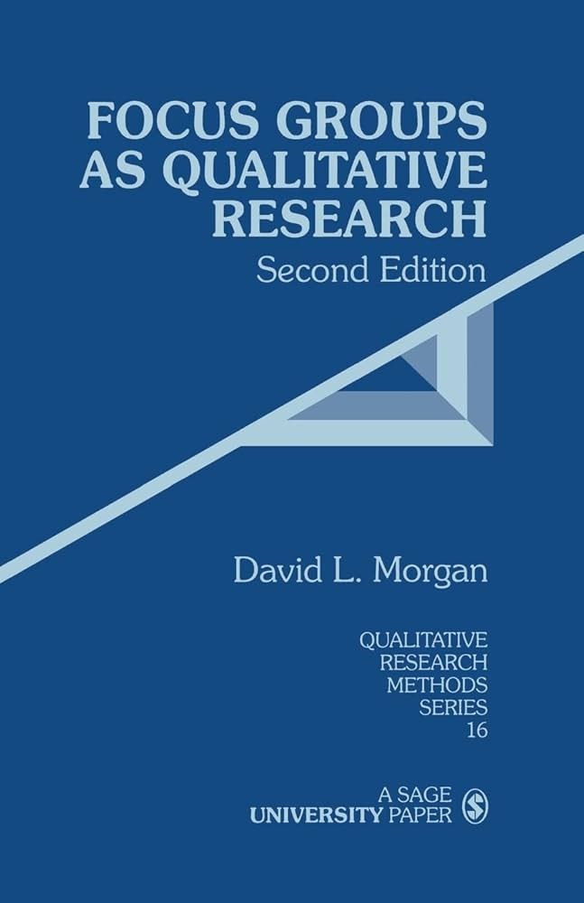

# Focus Groups

From the book: Focus Groups as Qualitative Research (David L. Morgan).

## 1. Definition and Core Characteristics of Focus Groups

- As a form of qualitative research, focus groups are basically group interviews, although not in the sense of an alternation between a researcher’s questions and the research participants’ responses. Instead, the reliance is on interaction within the group, based on topics that are supplied by the researcher who typically takes the role of a moderator. *(Page 11, Position 126)*
- A more inclusive approach broadly defines focus groups as a research technique that collects data through group interaction on a topic determined by the researcher. In essence, it is the researcher’s interest that provides the focus, whereas the data themselves come from the group interaction. *(Page 17, Position 203)*

## 2. Focus Groups as a Qualitative Method Compared to Other Methods

- Compared to participant observation, focus groups allow observation of a large amount of interaction on a topic in a limited period. However, this control may make focus groups somewhat unnatural. *(Page 20, Position 249)*
- Topics like attitudes and decision-making may be slighted in participant observation due to difficulty in observation, not lack of importance. *(Page 22, Position 276)*
- Focus groups excel in observing interactions, providing direct evidence of similarities and differences in opinions and experiences. Individual interviews, however, offer more control and depth per participant. *(Page 24, Position 295)*
- Focus groups offer targeted data aligned with researcher interests and are often considered “quick and easy,” especially compared to individual interviews. *(Page 28, Position 357)*
- Comparisons among participants provide insights into behaviors and motivations. Discussions in focus groups offer direct data on consensus and diversity. *(Page 30, Position 386)*
- Group settings may influence what participants say and how they say it, which can be a weakness. *(Page 31, Position 394)*

## 3. The Uses of Focus Groups in Research

- Focus groups can supplement primary methods such as surveys. *(Page 12, Position 140)*
- They assist in exploring survey results or evaluating program outcomes. *(Page 13, Position 148)*
- In combination with other methods, they can clarify findings or support preliminary research. *(Page 35, Position 440)*
- Self-contained focus groups explore attitudes and experiences. Experiences often generate richer discussions than opinions. *(Page 38, Position 488)*
- Sharing and comparing in focus groups helps researchers understand participant perspectives. *(Page 39, Position 498)*
- Exploratory focus groups can inform individual interviews, and vice versa. *(Page 41, Position 530)*
- Focus groups help create survey items by identifying domains, dimensions, and effective wordings. *(Page 46, Position 597)*
- For survey researchers: "Why don’t you ask them?" *(Page 49, Position 639)*

## 4. Planning and Research Design for Focus Groups

- Limit access to tapes to research staff unless public use is preplanned. *(Page 55, Position 716)*
- Key planning decisions include participant selection, group structure, size, and number. *(Page 58, Position 759)*
- Segmentation ensures homogeneity of background, aiding discussion and analysis. *(Page 60, Position 792)*
- Homogeneity in background (not attitudes) is crucial. Identical perspectives can flatten discussion. *(Page 61, Position 800)*
- Perceived differences, not actual ones, affect willingness to discuss. *(Page 62, Position 811)*
- Social roles affect participant dynamics; segmentation may be needed. *(Page 62, Position 819)*
- Segmented groups require more sessions to capture diversity within categories. *(Page 63, Position 825)*
- Strangers are preferred over acquaintances to avoid assumed knowledge. *(Page 63, Position 834)*
- Structured approaches suit projects with predefined agendas. *(Page 66, Position 874)*
- Structured formats may restrict participants’ genuine concerns. *(Page 67, Position 882)*
- Funnel strategy: start broad and move to specific questions for balanced insight. *(Page 69, Position 910)*
- Over-recruit by 20% to compensate for no-shows. *(Page 70, Position 933)*
- Ideal group size: 6–10 participants. *(Page 71, Position 937)*
- Projects should use 3–5 groups; more rarely adds new insights. *(Page 71, Position 948)*
- Only conduct as many groups as necessary for reliable answers due to resource costs. *(Page 73, Position 970)*

## 5. Conducting Focus Groups

- Merton et al. (1990) present four broad criteria for the effective focus group interview: It should cover a maximum range of relevant topics; provide data that are as specific as possible; foster interaction that explores the participants’ feelings in some depth; and take into account the personal context that participants use in generating their responses to the topic. They summarize these criteria as **range**, **specificity**, **depth**, and **personal context**. (Page 75, Position 989)

- Perspectives and personal contexts may be based on the social roles and categories that the participants occupy; they may also be rooted in more individual experiences. Either way, the point of doing a group interview is to bring a number of different perspectives into contact. Until they interact with others on a topic, individuals are often simply unaware of their own implicit perspectives. Moreover, the interaction in the group may present the need to explain or defend one’s perspective to someone who thinks about the world differently. (Page 76, Position 1008)

- The most obvious constraint on interview content is the fact that a typical discussion lasts 1 or 2 hours. It is difficult to ask more than 10 major questions, and often the number of questions should be lower. The more limited the time and the greater the desired depth, the fewer topics should be covered. (Page 78, Position 1030)

- Focus group moderators must simultaneously manage group dynamics, keep the discussion on track, and encourage depth. One technique is the use of “probe” questions—open-ended follow-ups that prompt further elaboration (e.g., “Can you tell me more about that?” or “What do others think?”). (Page 80, Position 1064)

- Moderators must also pay attention to nonverbal behaviors and the balance of participation. Some participants may dominate while others remain quiet. It is the moderator’s responsibility to draw out quieter members and tactfully manage dominant ones. (Page 81, Position 1073)

- Another responsibility is ensuring that the participants understand and remain focused on the topic. This includes clarifying confusing comments and periodically summarizing to ensure shared understanding. (Page 82, Position 1089)

- Good moderators build rapport while maintaining neutrality. Their style should be both encouraging and unobtrusive. This balance allows participants to feel safe expressing diverse opinions without being led or influenced. (Page 84, Position 1112)

## 6. Analyzing and Reporting Focus Group Results

- The analysis of focus group data involves more than summarizing what was said; it includes identifying patterns and themes that emerge across groups. The goal is to understand both commonalities and variations in participants’ perspectives. (Page 87, Position 1154)

- Transcripts are typically used for analysis, and the process usually begins with repeated reading to become familiar with the content. Coding involves labeling segments of the text according to themes or topics. (Page 88, Position 1171)

- A common approach is thematic analysis, which may be conducted inductively (themes emerge from the data) or deductively (themes are based on prior research or questions). Either way, the goal is to go beyond individual statements to identify meaningful patterns. (Page 89, Position 1187)

- Analysts must be careful to distinguish between strong group consensus and a vocal minority. The group setting may amplify some views while suppressing others. As such, careful attention to how ideas are expressed and by whom is critical. (Page 90, Position 1204)

- Reporting results involves describing the main themes, supporting them with representative quotes, and interpreting their significance. The report should explain how the themes relate to the research questions and context. (Page 91, Position 1217)

- It is important to be transparent about the analysis process, including how themes were identified and how disagreements among analysts (if any) were handled. This increases the credibility of the findings. (Page 92, Position 1233)

- Finally, reporting should include reflection on the strengths and limitations of using focus groups in the particular study. These might involve issues of group dynamics, sampling, or the influence of the moderator. (Page 93, Position 1246)
